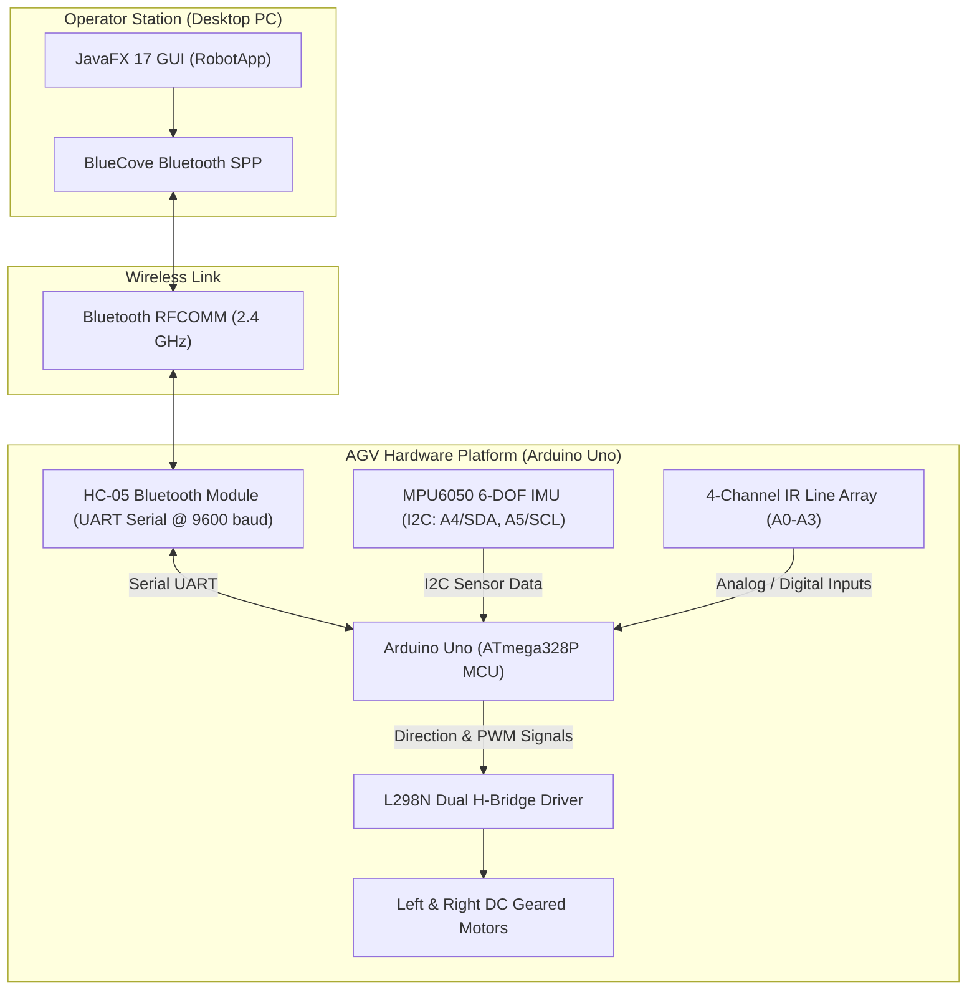

# Autonomous Guided Vehicle (AGV) & Bluetooth Control Station

An integrated mechatronics and control engineering system featuring an Autonomous Guided Vehicle (AGV) powered by an Arduino microcontroller and a companion JavaFX desktop control station. The system supports autonomous grid-based line navigation with closed-loop IMU yaw feedback, alongside a manual teleoperation mode over Bluetooth RFCOMM (SPP).

---

## Features

- **Dual Operational Modes**:
  - **Autonomous AGV Mode**: Automated trajectory following and coordinate-based grid navigation using a 4-channel infrared line-tracking sensor array and intersection detection.
  - **Manual Teleoperation Mode**: Direct wireless control over Bluetooth serial with directional steering (Forward, Backward, Differential Turn Left, Differential Turn Right) and speed throttling.
- **Closed-Loop Heading & Inertial Stabilization**:
  - Continuous yaw angle monitoring and rotational compensation using an **MPU6050 6-Axis Inertial Measurement Unit (IMU)** over I2C to execute precise 90-degree intersection turns.
- **Pulse-Width Modulation (PWM) Speed Regulation**:
  - Independent dual DC motor speed control via an **L298N Dual H-Bridge** driver with configurable turn forward delays and turn speeds.
- **JavaFX Desktop Station (`RobotApp`)**:
  - Graphical user interface built with JavaFX 17.
  - **Device Discovery Screen**: Scans for Bluetooth RFCOMM/SPP endpoints using the BlueCove library.
  - **Teleoperation UI**: Interactive directional control pad and operation mode toggle.
  - **Terminal / Chat Console**: Raw serial command console for transmitting diagnostic and coordinate commands directly to the vehicle.

---

## Hardware & Architecture



---

## Pinout Configuration

Verified from [`Robot_uno/src/Robot_config.h`](file:///e:/Ghanem-GitHub-Portfolio/Auto-Guided-Veical/Robot_uno/src/Robot_config.h):

| Component / Function | Arduino Pin | Description |
|---|---|---|
| Right Motor Direction 1 (`MOTOR_R1`) | `Pin 5` | L298N IN1 |
| Right Motor Direction 2 (`MOTOR_R2`) | `Pin 4` | L298N IN2 |
| Left Motor Direction 1 (`MOTOR_L1`) | `Pin 3` | L298N IN3 |
| Left Motor Direction 2 (`MOTOR_L2`) | `Pin 2` | L298N IN4 |
| Right Motor PWM (`RMOTOR_vel`) | `Pin 9` | L298N ENA (PWM) |
| Left Motor PWM (`LMOTOR_vel`) | `Pin 10` | L298N ENB (PWM) |
| Extreme Right IR Sensor (`EXTRIGHT_IR`) | `Pin A0` | Line tracking sensor 5 |
| Extreme Left IR Sensor (`EXTLEFT_IR`) | `Pin A1` | Line tracking sensor 1 |
| Left IR Sensor (`LEFT_IR`) | `Pin A2` | Line tracking sensor 2 |
| Right IR Sensor (`RIGHT_IR`) | `Pin A3` | Line tracking sensor 4 |
| MPU6050 SDA | `Pin A4` | I2C Data line |
| MPU6050 SCL | `Pin A5` | I2C Clock line |
| HC-05 Bluetooth TX/RX | `Pins 0 / 1` | Hardware Serial UART |

---

## Serial Command Protocol

The firmware communicates over standard Serial at `9600 baud`:

| Command | Mode | Action |
|---|---|---|
| `'1'` | Manual | Drive forward |
| `'2'` | Manual | Drive backward |
| `'3'` | Manual | Differential pivot turn right |
| `'4'` | Manual | Differential pivot turn left |
| `'-'` | Both | Toggle between Autonomous AGV and Manual modes |
| `XY` (e.g., `23`) | Autonomous | Set target grid coordinate destination `(x=2, y=3)` |
| `'-1'` | Autonomous | Reset AGV state |
| `'-2'` | Autonomous | Query current vehicle coordinate position `(ox, oy)` |
| `'-3'` | Autonomous | Configure turn forward delay parameter |

---

## Project Structure

```text
Auto-Guided-Veical/
├── RobotApp/                 # Desktop Bluetooth Control Application
│   ├── src/main/java/com/example/robotapp/
│   │   ├── Main.java                   # JavaFX entry point
│   │   ├── ControlUiController.java    # Directional buttons and mode switching
│   │   ├── ServerListScreenController.java # Bluetooth device scanning & connection
│   │   ├── ChatScreenController.java   # Serial terminal interface
│   │   └── SPPClient.java              # RFCOMM communication handler
│   ├── src/main/resources/com/example/robotapp/ # FXML views & CSS stylesheets
│   ├── lib/                            # Native BlueCove Bluetooth libraries
│   └── pom.xml                         # Maven build configuration (JavaFX 17)
├── Robot_uno/                # Microcontroller Firmware (PlatformIO)
│   ├── src/
│   │   ├── Robot_Sketch.cpp            # Setup and main execution loop
│   │   ├── Robot_config.h              # Pin definitions and global constants
│   │   ├── agv.cpp / agv.h             # Autonomous path navigation and IMU PID logic
│   │   ├── manual.cpp / manual.h       # Manual Bluetooth command parser
│   │   └── l298_driver.cpp / .h        # Motor low-level driver functions
│   └── platformio.ini                  # PlatformIO target definition (ATmega328P)
└── README.md
```

---

## Installation & Setup

### 1. Firmware Upload (Microcontroller)

1. Open the [`Robot_uno`](file:///e:/Ghanem-GitHub-Portfolio/Auto-Guided-Veical/Robot_uno) directory in [VS Code with PlatformIO](https://platformio.org/) or the Arduino IDE.
2. Connect the Arduino Uno via USB cable.
3. Build and flash the firmware:
   ```bash
   pio run --target upload
   ```

### 2. Desktop Control Application (RobotApp)

1. Requirements: **Java Development Kit (JDK) 11+** and **Apache Maven**.
2. Navigate to the [`RobotApp`](file:///e:/Ghanem-GitHub-Portfolio/Auto-Guided-Veical/RobotApp) directory:
   ```bash
   cd RobotApp
   mvn clean compile
   ```
3. Run the application:
   ```bash
   mvn javafx:run
   ```
4. Pair your computer with the vehicle's HC-05 Bluetooth module and select the device in the application's connection list.

---

## Circuit Schematic & Media

### Circuit Diagram


### Demonstration Video
- [Watch Demonstration Video](https://github.com/ahmed-atef-gad/Robot/assets/89663624/c31d5175-bbac-49aa-84a4-fb65e46cb46b)

---

## Author

- **Mohamed Ghanem** - [Eng-Ghanem](https://github.com/Eng-Ghanem)
